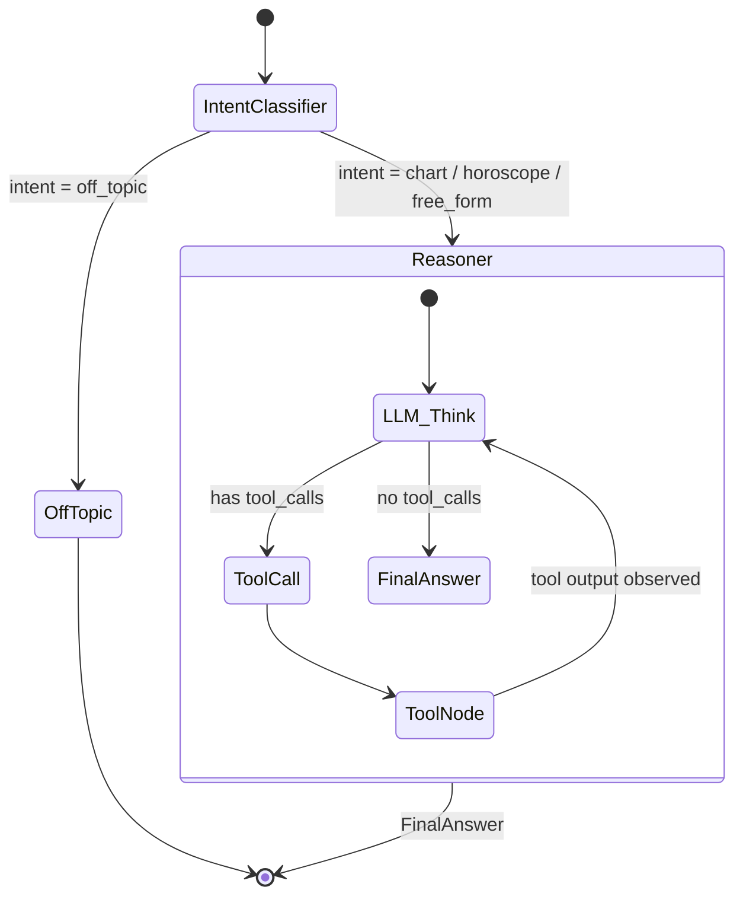

# AstroAgent — Aradhana's Agentic Vedic Astrologer

> _"Yathā Drishti, Tathā Srishti" — As is the vision, so is the creation._

AstroAgent is a full-stack, agentic AI astrology platform. Users share their birth details and converse with **Guruji** — a robust, context-aware Vedic astrologer agent that computes precise birth charts, reasons over planetary data using tool-calling, and provides spiritually grounded interpretations.

**Built with:** LangGraph · FastAPI · Next.js · MongoDB · Groq (LLaMA 3.3 70B) · Flatlib

---

## High-Level Architecture

```text
┌──────────────────────────────────────────────────────────────┐
│                        CLIENT (Next.js)                       │
│  ┌──────────┐  ┌──────────────┐  ┌───────────────────────┐   │
│  │ BirthForm│  │  ChatWindow  │  │   VedicChart (SVG)    │   │
│  │          │──│  (SSE Stream)│  │                       │   │
│  └──────────┘  └──────┬───────┘  └───────────────────────┘   │
│                       │ POST /api/chat (SSE)                  │
└───────────────────────┼──────────────────────────────────────┘
                        │
                        ▼
┌──────────────────────────────────────────────────────────────┐
│                     SERVER (FastAPI)                           │
│  ┌────────────────────────────────────────────────────────┐   │
│  │              LangGraph State Machine                   │   │
│  │                                                        │   │
│  │  START ──▶ IntentClassifier ──▶ Reasoner ◀──▶ Tools    │   │
│  │                │                    │                  │   │
│  │                ▼                    ▼                  │   │
│  │           OffTopic ──▶ END     Conditional ──▶ END     │   │
│  └────────────────────────────────────────────────────────┘   │
│  ┌──────────┐  ┌──────────┐  ┌──────────┐                    │
│  │ Auth API │  │ Profile  │  │ History  │                    │
│  │ (JWT)    │  │ (Mongo)  │  │ (Mongo)  │                    │
│  └──────────┘  └──────────┘  └──────────┘                    │
└──────────────────────────────────────────────────────────────┘
                        │
                        ▼
┌──────────────────────────────────────────────────────────────┐
│                     DATA LAYER                                │
│  ┌──────────────┐  ┌──────────────┐  ┌───────────────────┐   │
│  │   MongoDB     │  │   FAISS      │  │  Flatlib/Swiss    │   │
│  │  (Profiles,   │  │  (RAG Vector │  │  Ephemeris        │   │
│  │  Checkpoints) │  │   Store)     │  │  (Chart Math)     │   │
│  └──────────────┘  └──────────────┘  └───────────────────┘   │
└──────────────────────────────────────────────────────────────┘
```

## The LangGraph Agent Loop



**State Schema (`AgentState`):**
```python
class AgentState(TypedDict):
    messages: Annotated[list, add_messages]  # Full conversation history
    birth_details: Optional[dict]            # {date, time, place}
    intent: Optional[str]                    # Classified intent
    step_count: int                          # Loop budget guard
```

---

## Agent Capabilities

| Tool | Library | Description |
|------|---------|-------------|
| `geocode_place()` | geopy (Nominatim) | Resolves a place name to latitude, longitude, and IANA timezone. Required before chart computation. |
| `compute_birth_chart()` | flatlib + Swiss Ephemeris | Computes exact planetary positions, houses, and ascendant from ephemeris data. Prevents LLM hallucination of celestial mechanics. |
| `get_daily_transits()` | flatlib | Computes current planetary transits to compare against the user's natal chart. |
| `knowledge_lookup()` | FAISS (RAG) | Retrieves relevant passages from a curated set of Vedic astrology reference texts for grounded interpretations. |

**Execution Flow:**
```text
User: "Tell me about my career"
  └─▶ Reasoner decides: I need the birth chart first
       └─▶ geocode_place("Mumbai, India") → {lat: 19.07, lng: 72.87, tz: "Asia/Kolkata"}
            └─▶ compute_birth_chart(date, time, lat, lng, tz) → {planets: {...}, houses: {...}}
                 └─▶ Reasoner synthesizes a career reading based on exact placements
```

---

## Technical Highlights

- **Token-by-token streaming:** Implemented via Server-Sent Events (SSE) using LangChain's `astream_events(v2)` and parsed natively via React `ReadableStream`.
- **Intelligent Context Management:** The `compute_birth_chart` and `geocode_place` tools are wrapped in an LRU cache, drastically reducing API latency and cost for repeated queries.
- **Cross-session Memory:** User profiles and conversation histories are stored in MongoDB. The agent seamlessly recalls a user's birth chart upon return.
- **Graceful Failure Handling:** The frontend strictly monitors stream states to detect API timeouts or rate limits, falling back to a custom error recovery UI rather than hanging indefinitely.
- **Secure Authentication:** Implemented custom JWT-based authentication with bcrypt password hashing.

---

## Safety & Guardrails

The agent implements layered safety mechanisms to strictly govern LLM outputs:

1. **Semantic Routing (Layer 1):** Classifies every incoming message. Off-topic or adversarial requests (e.g., code generation, external knowledge queries) are intercepted and redirected before reaching the main reasoning loop.
2. **System Constraints (Layer 2):** Explicit instructions restrict the LLM from providing medical, financial, or legal certainty, ensuring ethical compliance within the astrology domain.
3. **Automated Evaluation (Layer 3):** An extensive evaluation pipeline (`evaluate.py`) utilizes an LLM-as-a-judge approach across a curated golden dataset of edge cases to continuously verify agent behavior.

---

## Setup & Installation

### Prerequisites
- Python 3.11+
- Node.js 18+
- MongoDB instance (local or Atlas URI)
- Groq API Key

### 1. Environment Setup

```bash
git clone https://github.com/swagatobauri/aradhana_life.git
cd aradhana_life

# Backend setup
python -m venv .venv
source .venv/bin/activate
pip install -r backend/requirements.txt

# Frontend setup
cd frontend
npm install
cd ..
```

### 2. Environment Variables

Create `.env` in the root directory:
```env
GROQ_API_KEY=gsk_your_key
MONGODB_URI=mongodb+srv://...
JWT_SECRET=your_secure_secret
```

Create `frontend/.env.local`:
```env
NEXT_PUBLIC_API_URL=http://localhost:8000
```

### 3. Running Locally

```bash
# Terminal 1: Backend
source .venv/bin/activate
uvicorn backend.main:app --reload --port 8000

# Terminal 2: Frontend
cd frontend
npm run dev
```

The application will be accessible at `http://localhost:3000`.

### 4. Running the Evaluation Harness

```bash
source .venv/bin/activate
PYTHONPATH=. python backend/evals/evaluate.py
```
This executes the test suite, evaluates the agent's responses against the golden set, and logs the metrics to `eval_history.csv`.

---

## Known Limitations & Trade-offs

In the interest of honest scoping, here are the known limitations of the current implementation:

1. **Free-Tier API Rate Limits:** The agent relies on Groq's free tier for LLaMA 3.3 70B, which enforces a strict 6,000 Tokens-Per-Minute (TPM) limit. Generating a large birth chart reading followed immediately by a follow-up question often triggers a `429 Rate Limit Exceeded` error. We built a custom frontend fallback UI to gracefully handle this limitation, but in a production environment, a paid tier would resolve this entirely.
2. **Missing House Systems:** The current `flatlib` implementation uses default house calculation methods. A production astrology app would likely require the ability to toggle between Placidus, Whole Sign, and other house systems.
3. **No Geographic Ambiguity Handling:** If a user inputs "Springfield", the `geocode_place` tool picks the most prominent match rather than asking the user to clarify which state/country they meant.
4. **LLM-as-a-Judge Subjectivity:** While we structured our evaluation harness with rigid 1-5 scoring rubrics, evaluating "warmth" and "tone" remains inherently subjective. The human agreement rate on the current judge is high, but not perfect.
