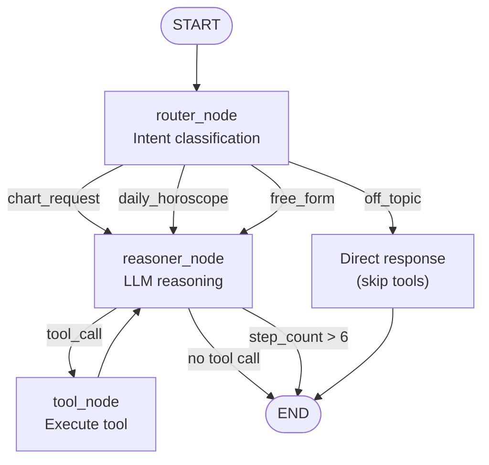

# AstroAgent — Aradhana Life

> An agentic AI astrology companion built with LangGraph, real ephemeris math, and a calm, conversational UI.

---

## Table of Contents

- [Overview](#overview)
- [Setup](#setup)
- [Architecture](#architecture)
- [Graph Diagram](#graph-diagram)
- [Evaluation](#evaluation)
- [Known Limitations](#known-limitations)

---

## Overview

AstroAgent is a chat-based astrology companion for [Aradhana](https://aradhana.app). Users share their birth details (date, time, place) and ask questions like *"what does my chart say about my career?"* or *"what's the energy for me today?"*. The agent reasons in steps, calls real tools to get real planetary data, and responds conversationally with warmth and care.

### Key Capabilities

| Feature | Description |
|---|---|
| **Birth chart computation** | Real planetary positions via flatlib ephemeris — never hallucinated |
| **Daily transits** | Current planetary positions compared to natal chart |
| **Knowledge retrieval** | RAG over curated astrology notes (planets, houses, signs, aspects) |
| **Safety guardrails** | Never presents readings as medical, financial, or legal advice |
| **Streaming UI** | Real-time SSE streaming with live tool activity indicators |

---

## Setup

### Prerequisites

- Python 3.11+
- Node.js 18+
- A [Groq](https://console.groq.com/) API key

### 1. Clone & configure

```bash
git clone <repo-url> aradhana_life
cd aradhana_life
cp .env.example .env
# Edit .env and add your GROQ_API_KEY
```

### 2. Backend

```bash
cd backend
python -m venv .venv
source .venv/bin/activate
pip install -r requirements.txt
uvicorn main:app --reload --port 8000
```

### 3. Frontend

```bash
cd frontend
npm install
npm run dev
```

The app will be available at `http://localhost:3000`.

---

## Architecture

### Tech Stack

| Layer | Technology |
|---|---|
| **LLM** | Groq — llama-3.3-70b-versatile |
| **Agent framework** | LangGraph 1.2.2 |
| **Ephemeris** | flatlib (real planetary computation) |
| **Geocoding** | geopy (Nominatim) + timezonefinder |
| **RAG** | ChromaDB + sentence-transformers |
| **API** | FastAPI + SSE (sse-starlette) |
| **Frontend** | Next.js 14 · TypeScript · Tailwind · Zustand · Framer Motion |

### Backend Structure

```
backend/
├── main.py                 # FastAPI entry point
├── api/routes.py           # /chat, /stream, /session endpoints
├── graph/
│   ├── state.py            # AgentState TypedDict
│   ├── graph.py            # LangGraph graph definition
│   ├── edges.py            # Conditional edge logic
│   └── nodes/              # router, reasoner, tool_node
├── tools/                  # 4 tools: chart, transits, geocode, RAG
├── rag/                    # ChromaDB vector store + astrology notes
└── prompts/                # System prompt definition
```

---

## Graph Diagram



### Agent State Flow

```
User message
  → Router classifies intent
    → Reasoner decides tool calls
      → Tool executes (ephemeris / geocode / RAG)
        → Reasoner observes result
          → Loop or final response
```

---

## Evaluation

The eval harness lives in `evals/` and contains:

- **`golden_set.jsonl`** — 25 versioned test cases covering valid charts, invalid dates, missing data, off-topic, adversarial inputs, and safety guardrails
- **`run_evals.py`** — One-command runner against the live agent
- **`judge.py`** — LLM-as-judge scoring with a 1–5 rubric
- **`scorecard.py`** — Terminal scorecard with pass rates, latency (p50/p95), and cost

Run evaluations:

```bash
cd evals
python run_evals.py
python scorecard.py
```

See [EVALUATION.md](evals/EVALUATION.md) for methodology and honest reflection.

---

## Known Limitations

1. **flatlib accuracy** — flatlib uses the Swiss Ephemeris under the hood but may have precision limits for dates far from the present epoch. For production use, consider validating against a reference ephemeris.

2. **Geocoding rate limits** — Nominatim (via geopy) has a 1 request/second policy. The agent caches results per session but does not persist across restarts.

3. **RAG corpus size** — The curated astrology notes are intentionally small (~20 documents). A production system would benefit from a larger, professionally curated knowledge base.

4. **Single-session state** — The current implementation holds state in memory per session. There is no persistence layer; restarting the server clears all sessions.

5. **No authentication** — This is a take-home demo. There is no user auth, rate limiting, or multi-tenancy.

6. **LLM dependency** — All reasoning flows through Groq/Llama. If the API is down or rate-limited, the agent cannot function. No fallback LLM is configured.

7. **Vedic vs Western** — The agent primarily uses Western tropical astrology via flatlib. Vedic (sidereal) support is not yet implemented but could be added via the ayanamsa correction in flatlib.

---

## License

This project was built as a take-home assignment for Aradhana. Not for redistribution.
# aradhana_life
