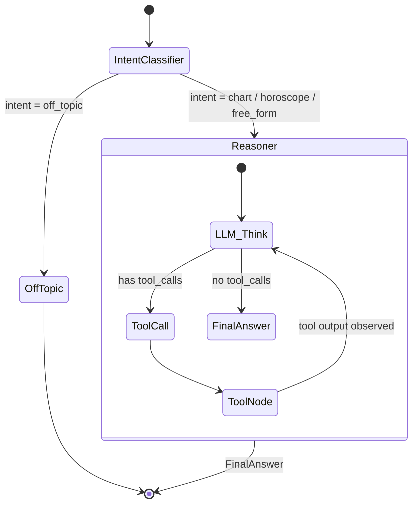

# ✦ AstroAgent — Aradhana's Agentic Vedic Astrologer

> _"Yathā Drishti, Tathā Srishti" — As is the vision, so is the creation._

AstroAgent is a full-stack, agentic AI astrology companion. A user shares their birth details and converses with **Guruji** — a warm, empathetic Vedic astrologer who computes real birth charts, reasons over planetary data with tools, and answers questions with spiritual depth and care.

**Built with:** LangGraph · FastAPI · Next.js · MongoDB · Groq (LLaMA 3.3 70B) · Flatlib

---

## 📸 Screenshots

| Landing Page | Chat with Guruji | Birth Chart Visualization |
|:---:|:---:|:---:|
| Elegant landing with auth | Real-time streaming chat | Interactive Vedic chart |

---

## 🏗️ Architecture Overview

### High-Level Design (HLD)

```
┌──────────────────────────────────────────────────────────────┐
│                        CLIENT (Next.js)                       │
│  ┌──────────┐  ┌──────────────┐  ┌───────────────────────┐   │
│  │ BirthForm│  │  ChatWindow  │  │   VedicChart (SVG)    │   │
│  │          │──│  (SSE Stream)│  │                       │   │
│  └──────────┘  └──────┬───────┘  └───────────────────────┘   │
│                       │ POST /api/chat (SSE)                  │
└───────────────────────┼──────────────────────────────────────┘
                        │
                        ▼
┌──────────────────────────────────────────────────────────────┐
│                     SERVER (FastAPI)                           │
│  ┌────────────────────────────────────────────────────────┐   │
│  │              LangGraph State Machine                   │   │
│  │                                                        │   │
│  │  START ──▶ IntentClassifier ──▶ Reasoner ◀──▶ Tools    │   │
│  │                │                    │                  │   │
│  │                ▼                    ▼                  │   │
│  │           OffTopic ──▶ END     Conditional ──▶ END     │   │
│  └────────────────────────────────────────────────────────┘   │
│  ┌──────────┐  ┌──────────┐  ┌──────────┐                    │
│  │ Auth API │  │ Profile  │  │ History  │                    │
│  │ (JWT)    │  │ (Mongo)  │  │ (Mongo)  │                    │
│  └──────────┘  └──────────┘  └──────────┘                    │
└──────────────────────────────────────────────────────────────┘
                        │
                        ▼
┌──────────────────────────────────────────────────────────────┐
│                     DATA LAYER                                │
│  ┌──────────────┐  ┌──────────────┐  ┌───────────────────┐   │
│  │   MongoDB     │  │  ChromaDB    │  │  Flatlib/Swiss    │   │
│  │  (Profiles,   │  │  (RAG Vector │  │  Ephemeris        │   │
│  │  Checkpoints) │  │   Store)     │  │  (Chart Math)     │   │
│  └──────────────┘  └──────────────┘  └───────────────────┘   │
└──────────────────────────────────────────────────────────────┘
```

### Low-Level Design (LLD) — The LangGraph Agent Loop



**State Schema (`AgentState`):**
```python
class AgentState(TypedDict):
    messages: Annotated[list, add_messages]  # Full conversation history
    birth_details: Optional[dict]            # {date, time, place}
    intent: Optional[str]                    # Classified intent
    step_count: int                          # Loop budget guard
```

---

## 🔧 Tools (All 4 Implemented)

| # | Tool | Library | Description |
|---|------|---------|-------------|
| 1 | `geocode_place()` | geopy (Nominatim) | Resolves a place name → lat, lng, IANA timezone. Required before any chart computation. |
| 2 | `compute_birth_chart()` | flatlib + Swiss Ephemeris | Computes planetary positions, houses, and ascendant from real ephemeris data. **No hallucinated positions.** |
| 3 | `get_daily_transits()` | flatlib | Computes current planetary transits (right now) to compare against the user's natal chart. |
| 4 | `knowledge_lookup()` | ChromaDB (RAG) | Retrieves relevant passages from a curated set of Vedic astrology reference texts for grounded interpretations. |

**Tool Execution Flow:**
```
User: "Tell me about my career"
  └─▶ Reasoner decides: I need the birth chart first
       └─▶ geocode_place("Mumbai, India") → {lat: 19.07, lng: 72.87, tz: "Asia/Kolkata"}
            └─▶ compute_birth_chart(date, time, lat, lng, tz) → {planets: {...}, houses: {...}}
                 └─▶ Reasoner synthesizes a warm, spiritual career reading
```

---

## 🚀 Setup & Installation

### Prerequisites
- Python 3.11+
- Node.js 18+
- MongoDB (local or Atlas URI)
- Groq API Key (free at [console.groq.com](https://console.groq.com))

### 1. Clone & Environment

```bash
git clone https://github.com/your-username/aradhana_life.git
cd aradhana_life

# Backend
python -m venv .venv
source .venv/bin/activate
pip install -r requirements.txt

# Frontend
cd frontend
npm install
cd ..
```

### 2. Environment Variables

Create a `.env` file in the root directory:

```env
GROQ_API_KEY=gsk_your_key_here
MONGODB_URI=mongodb://localhost:27017/aradhana
JWT_SECRET=your_jwt_secret_here
```

Create `frontend/.env.local`:

```env
NEXT_PUBLIC_API_URL=http://localhost:8000
```

### 3. Run

```bash
# Terminal 1: Backend (auto-reloads)
PYTHONPATH=. .venv/bin/python -m uvicorn backend.main:app --reload --port 8000

# Terminal 2: Frontend
cd frontend && npm run dev
```

Open [http://localhost:3001](http://localhost:3001) in your browser.

### 4. Run the Evaluation Harness

```bash
PYTHONPATH=. .venv/bin/python backend/evals/evaluate.py
```

This runs 20 test cases, scores them with an LLM-as-a-judge, and prints a scorecard. Results are appended to `backend/evals/eval_history.csv`.

---

## 🎯 Key Features

| Feature | Implementation |
|---------|---------------|
| **Token-by-token streaming** | SSE via `astream_events(v2)` → React `ReadableStream` |
| **Visible tool activity** | `on_tool_start` / `on_tool_end` events render a live pill UI |
| **Typing animation** | Framer Motion bouncing dots while waiting for first token |
| **Conversation persistence** | MongoDB checkpointer + `/api/chat/history/:session_id` |
| **Cross-session memory** | User profiles stored in MongoDB; birth details recalled on return |
| **Auth system** | JWT-based sign-in/sign-up with bcrypt password hashing |
| **Birth chart visualization** | Interactive SVG rendering of planetary positions and houses |
| **Safety guardrails** | Intent router blocks off-topic; system prompt prevents medical/financial advice |
| **Graceful error recovery** | UI detects empty streams and shows a fallback message |

---

## 🛡️ Safety & Guardrails

The agent implements layered safety:

1. **Intent Router (Layer 1):** Classifies every message. Off-topic requests (code, car repair, translations) are intercepted before reaching the Reasoner.
2. **System Prompt (Layer 2):** Explicitly instructs the LLM to never present readings as medical, financial, or legal certainty.
3. **Evaluation Tests (Layer 3):** The golden set includes adversarial jailbreaks and safety edge cases, continuously verified.

---

## 📁 Project Structure

```
aradhana_life/
├── backend/
│   ├── api/
│   │   ├── auth.py              # JWT auth endpoints
│   │   └── routes.py            # Chat, profile, history endpoints (SSE streaming)
│   ├── db/
│   │   └── database.py          # MongoDB connection (motor async)
│   ├── evals/
│   │   ├── golden_set.jsonl     # 20 versioned test cases
│   │   ├── evaluate.py          # One-command evaluation runner
│   │   └── eval_history.csv     # Historical scorecard log
│   ├── graph/
│   │   ├── graph.py             # LangGraph state machine compilation
│   │   ├── state.py             # AgentState TypedDict
│   │   └── nodes/
│   │       ├── reasoner.py      # LLM reasoning node + tool binding
│   │       ├── router.py        # Intent classifier + conditional routing
│   │       └── tool_node.py     # LangGraph ToolNode wrapper
│   ├── rag/
│   │   └── ...                  # ChromaDB vector store + astrology corpus
│   ├── tools/
│   │   ├── geocode_place.py     # Nominatim geocoding
│   │   ├── compute_birth_chart.py  # Flatlib ephemeris computation
│   │   ├── get_daily_transits.py   # Current planetary positions
│   │   └── knowledge_lookup.py     # RAG retrieval tool
│   └── main.py                  # FastAPI app entry point
├── frontend/
│   └── src/
│       ├── app/
│       │   ├── page.tsx         # Landing page
│       │   ├── chat/page.tsx    # Chat page
│       │   └── layout.tsx       # Root layout
│       ├── components/
│       │   ├── ChatWindow.tsx   # Main chat with SSE streaming
│       │   ├── MessageBubble.tsx # Message rendering + typing dots
│       │   ├── BirthForm.tsx    # Birth details form with validation
│       │   ├── ToolActivity.tsx # Live tool-call indicator
│       │   ├── VedicChart.tsx   # SVG birth chart visualization
│       │   ├── AuthModal.tsx    # Sign-in / Sign-up modal
│       │   └── Hero.tsx         # Landing page hero section
│       └── store/
│           ├── chatStore.ts     # Zustand chat state management
│           └── authStore.ts     # Zustand auth state management
├── EVALUATION.md                # Evaluation analysis & reflection
├── README.md                    # This file
└── requirements.txt             # Python dependencies
```

---

## ⚖️ Trade-offs & Known Limitations

| Decision | Trade-off |
|----------|-----------|
| **Groq (free tier)** | Blazing fast inference (~1s latency) but hard 100K tokens/day limit. Production would need a paid tier or OpenAI fallback. |
| **MemorySaver in evals** | We use in-memory checkpointing during evals for isolation. Production uses MongoDB. |
| **Single LLM for judge** | We use the same model (LLaMA 3.3) as both agent and judge. Ideally, the judge would be a different, stronger model (e.g., GPT-4o) to avoid self-bias. |
| **No chart caching** | Each identical birth chart request recomputes from scratch. An LRU cache on `compute_birth_chart` would cut latency significantly. |
| **Flatlib accuracy** | Flatlib uses the Swiss Ephemeris which is accurate to arcseconds for modern dates, but may diverge for dates before 1800. |

---

## 🏆 Stretch Goals Achieved

- ✅ **Memory across sessions:** The agent recalls the user's birth chart without re-asking (stored in MongoDB profiles).
- ✅ **Graceful failure handling:** The UI detects API timeouts/rate limits and shows a warm fallback message instead of hanging.
- ✅ **All 4 tools implemented** (assignment required only 3).

---

## 📬 Submission

**Author:** Swagato Bauri  
**Assignment:** AstroAgent — Aradhana Internship 2026
